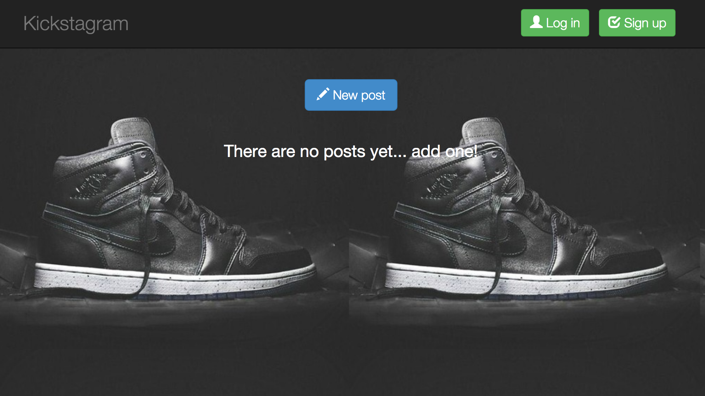
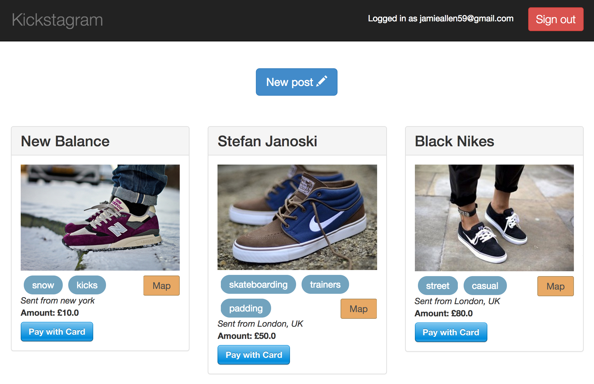

Kickstagram [](https://codeclimate.com/github/jamieallen59/Kickstagram)
=============

My clone of instagram, but spicifically for your favourite shoes. The more fly, the better!


<!-- A working version of the app can be found here: [Kickstagram](http://kicksta-gram.herokuapp.com/) -->

Technologies and methods used:
- Uploading and processing images using Paperclip, hosting via Amazon S3
- Managing secret information (e.g. private keys)
- Many-to-many relationships in Rails (with tagging)
- Geocoding with Google Maps
- Twitter Bootstrap
- Creating APIs using Rails + jBuilder
- Payments using Stripe

Go to the homepage, sign up and post your favourite kicks. Set a price at which to sell your picture and allow people to see where you've posted from, using Gmaps.



### Have a look at the code
```sh
git clone git@github.com:jamieallen59/Kickstagram.git
cd Kickstagram
bundle
bin/rake db:create db:migrate
```

### How to run it
```sh
cd Kickstagram
bin/rails s
```

open your browser and go to [localhost:3000](http://localhost:3000)

### Run the tests
```sh
cd Kickstagram
rspec
```

### Add seed data
```sh
bin/rake db:seed
```
